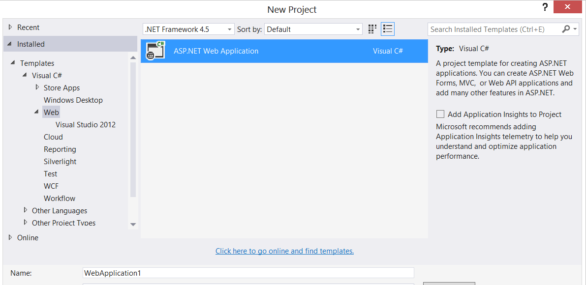
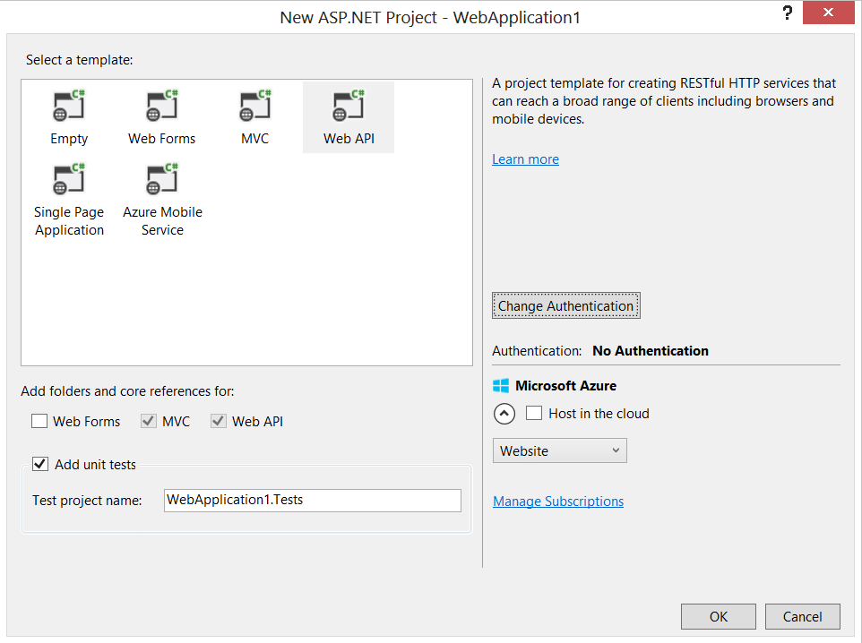

# ASP.NET MVC Workshop


Ihr Trainer: [Johannes Hoppe](http://www.haushoppe-its.de) von [GROSSWEBER](http://grossweber.com/)


## Tag 1 - Agenda

1. [Anlegen eines ASP.NET Web API Projekts (Routing, Bundling)](#projekt)
2. [Anlegen von DTOs / POCOs (Geschäftsobjekte)](#poco)
3. [Verwendung von IoC & Dependency Injection](#ioc)
4. [Einrichten von Entity Framework, Code First](#ef)
6. [Refactoring zu Repository](#repository)
6. [Erstellen eines MVC Controllers](#controller)
7. [Erstellen eines Web API Controllers](#controller)
8. Best Practices (z.B. T4MVC)


<a name="projekt"></a>
## 1. Anlegen eines ASP.NET Web API Projekts

Während des Workshops wählen wir einen einfachen Anwendungsfall aus. 
In den abgebildeten Beispielen wird eine Software entwickelt, welche Kunden verwaltet. Selbstverständlich können Sie andere Entitäten wählen. 

Wir verwenden folgendes Projekt-Template aus Visual Studio:
File > New > Project > Templates > Visual C# > Web > **"ASP.NET Web Application"**



Dabei wählen wir ein Web API Projekt aus:



Wir besprechen folgende Ordner:

1. Models
2. Views
3. Controllers

sowie

1. Content
2. Scripts


<a name="poco"></a>
## 2. Anlegen von DTOs / POCOs (Geschäftsobjekte)

Wir werden einfache "Data Transfer Objekte" (DTO) bzw. "Plain Old CLR Objects" (POCO) verwenden. Hiermit können wir die Daten unserer "Geschäftslogik" halten. Es gibt verschiedene Architektur-Stile, bei vielen sollten "Geschäftsobjekte" nicht nur Daten sondern auch Methoden besitzen. Für eine einfache Anwendung ist es absolut ausreichend, nicht zwischen "Entitäten" (ein Begriff des [Domain Driven Designs](http://dddcommunity.org/) von Eric Evans) und zwischen DTOs / POCOs zu unterscheiden. Wir verwenden die POCOs direkt und hauchen Ihnen später etwas Leben ein - mithilfe des Entity Frameworks. Es ist aber wichtig zu erkennen, das wir dadurch ein "**Anemic** domain model" erstellen.

Es gibt somit die Entität "Kunde", welche eine beliebige Anzahl an Rechnungen besitzen kann:

```csharp
public class Customer
{
    public Customer()
    {
        Invoices = new List<Invoice>();
    }

    public int Id { get; set; }
    public string FirstName { get; set; }
    public string LastName { get; set; }
    public string Mail { get; set; }
    public DateTime DateOfBirth { get; set; }
    public virtual ICollection<Invoice> Invoices { get; set; }
}

public class Invoice
{
    public int Id { get; set; }
    public decimal Amount { get; set; }

    public int CustomerId { get; set; }                     
    public virtual Customer Customer { get; set; } 
}


```


<a name="ioc"></a>
## 3. Verwendung von IoC & Dependency Injection

Der Begriff "**Inversion of Control**" bezeichnet ein Umsetzungsparadigma, bei dem die Kontrolle über die Instanzierung von Objekten nicht mehr der verwendeten Klassen obliegt. Statt dessen wird die "Kontrolle" umgekehrt, d.h. die verwendende Klasse bekommt das zu verwendende Objekt durch eine andere Kontrolleinheit. Konkret verwenden wir das "**Dependency Injection**"-Prinzip, welches eine besonders beliebte Ausprägung von IoC ist. Üblicherweise verwendet man einen existierenden IoC-Container, welcher viel Arbeit abnehmen kann. Eine Empfehlung ist das Framework Autofac:

```csharp
public class IocConfig
{
    public static void Register()
    {
        var builder = new ContainerBuilder();

        // Registers all ASP.NET MVC controllers
        builder.RegisterControllers(Assembly.GetExecutingAssembly());

        // Registers all Web API controllers
        builder.RegisterApiControllers(Assembly.GetExecutingAssembly());
           
        // All other types to register
        builder.RegisterType<DataContext>().InstancePerRequest();

        var container = builder.Build();

        // Set the dependency resolver for MVC
        var mvcResolver = new AutofacDependencyResolver(container);
        DependencyResolver.SetResolver(mvcResolver);

        // Set the dependency resolver for Web API.
        var webApiResolver = new AutofacWebApiDependencyResolver(container);
        GlobalConfiguration.Configuration.DependencyResolver = webApiResolver;
    }
}

```


<a name="ef"></a>
## 4. Einrichten von Entity Framework, Code First

Als Data Access Layer (DAL) verwenden wir das Entitiy Framework. Ältere Versionen waren an das .NET Framework gekoppelt. Die neueste Versionen 6 ist nun direkt per [Nuget](https://www.nuget.org/packages/entityframework) verfügbar.  
Bitte beachten Sie, dass die feste Verdrahtung der Geschäftslogik mit einem Objektrelationen Mapper bei einer größeren Anwendung sorgfältig geprüft werden sollte!

Um mit dem Code-First Ansatz zu starten, ist es notwendig eine Klasse zu erstellen, welche von System.Data.Entity.DbContext erbt. Hier geben wir alle vom EF zu berücksichtigen POCOs an. Wir folgen dem "Convention over Configuration" Ansatz.

```csharp
public class DataContext : DbContext
{
    public DbSet<Customer> Customers { get; set; }
    public DbSet<Invoice> Invoices { get; set; }

    protected override void OnModelCreating(DbModelBuilder modelBuilder)
    {
        modelBuilder.Configurations.Add(new InvoiceMap());
    }
}
```

Natürlich darf man einen passenden Connection-String nicht vergessen:

```xml
<connectionStrings>
    
    <!-- Beispiel 1 -->
    <add name="DefaultConnection" connectionString="Data Source=(local);Initial Catalog=TestDb;Integrated Security=SSPI;" providerName="System.Data.SqlClient" />

    <!-- Beispiel 2 -->
    <add name="DefaultConnection" connectionString="Data Source=(LocalDb)\v11.0;AttachDbFilename=|DataDirectory|\TestDb.mdf;Initial Catalog=TestDb;Integrated Security=True" providerName="System.Data.SqlClient" />

</connectionStrings>
```


### 4.1 Mockbarer Context per Interface (ab EF5)

Ein klassischer Weg zu "Ausmocken" von Objekten ist die Verwendung von Interfaces:


```csharp
public class DataContext : DbContext, IDataContext
{
    /* [...] */
}

public interface IDataContext
{
    IDbSet<Customer> Customers { get; set; }
    IDbSet<Invoice> Invoices { get; set; }

    int SaveChanges();
}

```

Das originale DbSet implementiert bereits das Interface IDbSet.
Als Ersatz bei Unit-Tests empfehle ich zum Beispiel folgendes In-Memory-Dbset:
https://www.nuget.org/packages/FakeDbSet/

Zusammen mit dem Mocking-Framework [Moq](https://github.com/Moq/moq4) können wir so sehr leicht IDbSet (durch FakeDbSet) und IMyContext (durch Moq) wie folgt ersetzen:

```csharp
InMemoryDbSet<Customer> inMemoryDbSet = new InMemoryDbSet<Customer>(true);

var mockedContext = new Mock<IMyContext>();
mockedContext.Setup(m => m.Customers).Returns(inMemoryDbSet);
repository = new CustomerRepository(mockedContext.Object);

```


### 4.2 Mockbarer Context per Override (ab EF6)

Version 6 des Entity Framework ist direkt mit Objekten im Arbeitsspeicher testbar. Für die Version 5 des Entity Frameworks war es noch zwingend notwendig, das Objekt mit einem Interface zu maskieren. Seit Version 6 ist kein zusätzliches Interface notwendig, es da alle relevanten Properties von `DbSet<T>` als virtuell markiert wurden. 

Folgender Quelltext demonstriert einen solchen Unit-Test, welcher eine simple Liste verwendet. Der Test soll beweisen, dass tatsächlich alle vorhanden Kunden-Entitäten von der Methode `GetCustomers` berücksichtigt werden. In diesem Beispiel wird das Unit-Test Framework "Machine.Specifications" (MSpec) verwendet. MSpec kann direkt über Nuget bezogen werden. Die Syntax von MSpec ermöglicht gut lesbare Tests im "Behavior-Driven Development" (BDD) Stil.  

Das Framework "Fluent Assertions" stellt die Erweiterungs-Methode "Should()" bereit. Als Mocking-Framework wird "NSubstitute" eingesetzt. 

```

// Moq
[Subject(typeof(CustomersApiController))]
public class When_getting_customers_using_Moq
{
    static CustomersController controller;
    static IQueryable<Customer> result;

    Establish context = () =>
        {
            var data = new List<Customer> 
            { 
                new Customer { FirstName = "Test1" }, 
                new Customer { FirstName = "Test2" } 
            }.AsQueryable();

            var mockSet = new Mock<DbSet<Customer>>();
            mockSet.As<IQueryable<Customer>>().Setup(m => m.Provider).Returns(data.Provider);
            mockSet.As<IQueryable<Customer>>().Setup(m => m.Expression).Returns(data.Expression);
            mockSet.As<IQueryable<Customer>>().Setup(m => m.ElementType).Returns(data.ElementType);
            mockSet.As<IQueryable<Customer>>().Setup(m => m.GetEnumerator()).Returns(data.GetEnumerator());

            var mockContext = new Mock<DataContext>();
            mockContext.Setup(c => c.Customers).Returns(mockSet.Object);

            controller = new CustomersController(mockContext.Object);
        };

    Because of = () => result = controller.GetCustomers();

    It should_return_all_customers = () => result.Count().Should().Be(2);
}


// NSubstitute
[Subject(typeof(CustomersController))]
public class When_getting_customers
{
    static CustomersController controller;
    static IQueryable<Customer> result;

    Establish context = () =>
        {
            var data = new List<Customer> 
            { 
                new Customer { FirstName = "Test1" }, 
                new Customer { FirstName = "Test2" } 
            }.AsQueryable();

            var mockSet = Substitute.For<IDbSet<Customer>, DbSet<Customer>>();
            mockSet.Provider.Returns(data.Provider);
            mockSet.Expression.Returns(data.Expression);
            mockSet.ElementType.Returns(data.ElementType);
            mockSet.GetEnumerator().Returns(data.GetEnumerator());

            var mockContext = Substitute.For<DataContext>();
            mockContext.Customers.Returns(mockSet);

            controller = new CustomersController(mockContext);
        };

    Because of = () => result = controller.GetCustomers();

    It should_return_all_customers = () => result.Count().Should().Be(2);
}
``` 


### 4.3. Integrationstests mit dem Entity Framework

Die Verwendung einer ganz normalen "In-Memory"-Liste hilft dabei, mit einfachen Mitteln schnell eine hohe Testabdeckung zu erreichen. Leider wird bei "In-Memory"-Daten der "LINQ to Objects" Provider verwendet, welcher sich vom "LINQ to Entities" Provider für echte Datenbankoperationen unterscheidet. Die Limitation bei "In-Memory"-Daten beschreibt Microsoft unter anderem in einem ausführlichen Artikel [6]. 

Testet man Code, welcher mit einer Datenbank interagiert, so spricht man von einem Integrationstest. In der Regel sind Integrationstests verhältnismäßig langsam und fehleranfällig. Andererseits sind Sie unverzichtbar, denn nur ein Test gegen eine echte Datenbank stellt sicher, das alle Feinheiten des Ziel-Datenbanksystems berücksichtigt wurden. Idealerweise lässt man Integrationstests regelmäßig automatisch laufen (zum Beispiel einmal Nachts) und verwendet während der Entwicklung bevorzugt Unit-Tests. 

Neben den beiden üblichen Vorgehensweisen (Integrationstests oder Unit-Tests im Arbeitsspeicher) gibt es einen Zwischenweg. Das Framework "Effort" verwendet eine eigene In-Memory Datenbank und emuliert einen relationalen Datenbankserver. Das Verhalten des Entity Frameworks entspricht nun weitgehend dem Verhalten, welches bei der Verwendung des Microsoft SQL Server gegeben wäre. Man muss aber beachten, dass Stored Procedures, Views und Trigger nicht unterstützt werden. Dies muss aber kein Problem darstellen. Gerade Stored Procedures werden häufig gescholten, da sie Logik in der Datenbank verlagern. Ähnlich verhält es sich mit Views und Trigger. Ändert man die Logik auf der Datenbank ab, so kann dies Einfluss auf das Laufzeitverhalten des Codes haben. Sind Datenbank und Code nicht mehr synchron, ist auch das Verhalten der Anwendung nicht mehr deterministisch. Sofern man die Wahl hat, sollte man daher dem Entity Framework (oder einem anderen ORM) eine führende Rolle überlassen und Stored Procedures, Views und Trigger gar nicht erst verwenden.

Für den "Code First"-Ansatz stellt Effort die `DbConnectionFactory` zur Verfügung. Hiermit lässt sich eine komplett isolierte In-Memory Datenbank erstellen, welche nach der Verwendung wieder verworfen wird. Der Befehl hierfür lautet:

```
DbConnection connection = Effort.DbConnectionFactory.CreateTransient();
````

Nun muss der `DataContext` noch um einen weiteren Konstruktor ergänzt werden, damit dieser die gefälschte Datenbankverbindung akzeptiert:

```
public class DataContext : DbContext
{
    public DataContext() { }
    public DataContext(DbConnection connection) : base(connection, true) { }

    /* [...] */
}
``` 

Folgender Code demonstriert die Verwendung von Effort anhand des CustomersController. Wie man an der zweiten Behauptungen erkennen kann, werden auch Primärschlüssel korrekt inkrementiert - was bei der Verwendung einer Liste nicht funktionieren würde. 

~~~~~
[Subject(typeof(CustomersController))]
public class When_getting_customers
{
    static CustomersController controller;
    static IQueryable<Customer> result;

    Establish context = () =>
        {
            DbConnection connection = Effort.DbConnectionFactory.CreateTransient();
            DataContext context = new DataContext(connection);
            controller = new CustomersController(context);

            Customer customer1 = new Customer { FirstName = "Test1" };
            Customer customer2 = new Customer { FirstName = "Test2" };

            context.Customers.AddRange(new[] {customer1, customer2});
            context.SaveChanges();
        };

    Because of = () => { result = controller.GetCustomers(); };

    It should_return_all_customers = () => result.Count().Should().Be(2);
    It should_increment_primary_keys = () => result.First().Id.Should().Be(1);
}
~~~~~


<a name="repository"></a>
## 5. Refactoring: Verwendung des Repository-Patterns 

Der bestehende Code soll refactored werden. Möglichst viel Logik soll aus dem Controller verschwinden und in ein Repository ausgelagert werden! Die bereits vorhandene Integration von Autofac sowie bestehende Tests erleichtern die Arbeit.


<a name="controller"></a>
## 6. und 7. Implementierung MVC Controllers / Web API Controllers

Wir werden einen MVC Controller sowie einen Web API Controller anlegen, dies wird durch das Tooling von Visual Studio sehr gut unterstützt. 

Eine auf Azure gehostete Version des Kunden-Controllers (Web API) sehen sie hier:
http://ex.extjs-kochbuch.de/api/customer

Der Controller wird durch folgende [Help Page](http://www.asp.net/web-api/overview/creating-web-apis/creating-api-help-pages) beschrieben:
http://ex.extjs-kochbuch.de/help

Den Quelltext finden Sie hier:
[CustomerController.cs](https://github.com/JohannesHoppe/ExtJsKochbuch/blob/master/examples/Kochbuch/Controllers/CustomerController.cs)

Man beachte das Attribute Routing, welches in der Web API 2 neu hinzu gekommen ist:
```
[Route("api/customer/reset")]
public HttpResponseMessage GetReset()
```

**Der Controller ist nicht nur unvollständig, sondern hat auch einen Bug! Finden Sie den Bug, verwenden Sie einen Unit-Test zu Verfifikation!
**


## Aufgaben zu Nacharbeit

Nach Ende des Tages sollten Sie folgende Aufgaben eigenständig durchführen können.

1. Erstelle Sie ein passendes Projekt per Visual Studio
2. Implementieren Sie IoC mit Autofac
3. Lege Sie einen Web API Controller an
4. Laden Sie Daten per $.get und $.post
5. **Erstelle Sie das CustomerRepository** (Unter Einsatz von IoC)


<hr>

_&copy; 2015, Johannes Hoppe_
