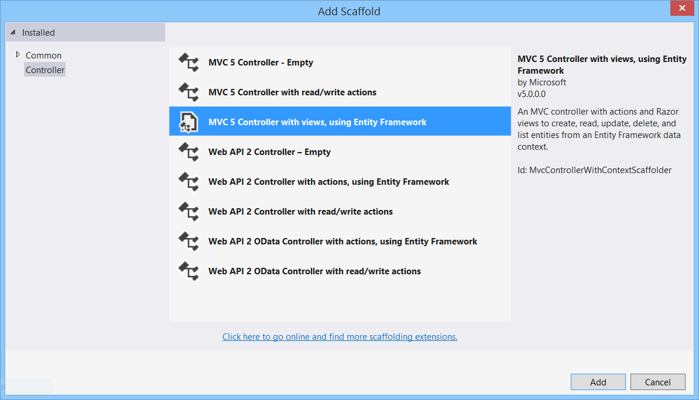
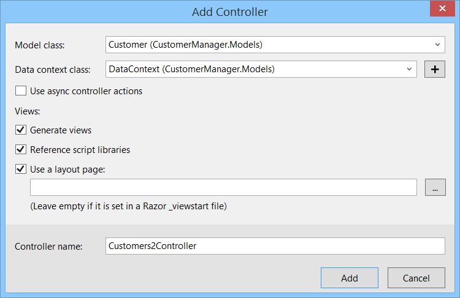
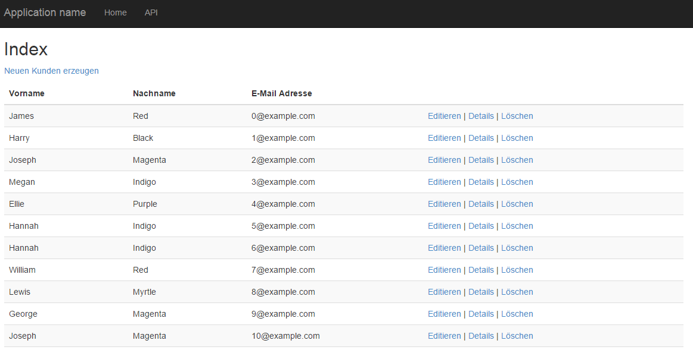
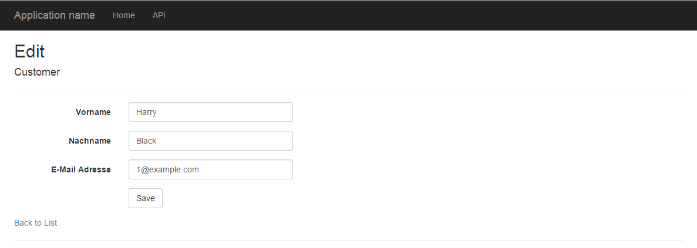

# ASP.NET MVC Workshop


Ihr Trainer: [Johannes Hoppe](http://www.haushoppe-its.de) von [GROSSWEBER](http://grossweber.com/)


## Tag 2 - Agenda

1. [Besprechung Ergebnisse des Refactoring, Wiederholung Unit Testing](#mspec)
2. [Grundlagen ASP.NET MVC](#grundlagen)
    * Routing und Bundling
    * Sections
    * Partial Views
3. [Formulare mit ASP.NET MVC](#formulare)
4. [Action Filter (MVC)](#filter)
5. [OData](#odata)


<a name="mspec"></a>
## 1. Besprechung Ergebnisse des Refactorings

Es hat sich herausgestellt, dass durch das geforderte Refactoring auch die Tests angepasst werden mussten. Je mehr Aufgaben eine Klasse erfüllt, desto mehr Tests müssen bei Änderungen nachgepflegt werden. Daher ist es gut Belange in verschiedene Architektur-Schichten zu trennen. Bitte berücksichtigen Sie das "Single-Responsibility-Prinzip (SRP)". Im Idealfall hat eine Änderung am Code auch nur eine weitere Änderung an einem Unit-Test zur Folge! 

Hier erneut das minimale Setup eines Unit-Tests.

```
using FluentAssertions;
using Machine.Specifications;

[Subject("Test")]
public class When_doing_a_simple_test
{
    static int value1;
    static int value2;
    static int result;

    private Establish context = () => { value1 = 1; value2 = 2; };

    Because of = () => result = value1 + value2;

    It should_have_the_expected_result = () => result.Should().Be(3);
}
```


<a name="grundlagen"></a>
## 2. ASP.NET MVC Grundlagen

### Bundling und Routing

Das Bundling von ASP.NET MVC wird in der Datei `BundleConfig.cs` gesteuert. Hier lässt sich einstellen, welche CSS und JavaScript-Dateien ausgeliefert werden sollen. Für den produktiven Betrieb können die Dateien zusammen gefasst und verkleinert werden.

Das Routing von ASP.NET MVC wird in der Datei `RouteConfig.cs` gesteuert.
Das Routing von der ASP.NET Web API wird über die Datei `WebApiConfig.cs` geregelt. 


### Sections
Die Methode "RenderSection" dient zum Rendern von zuvor benannten Bereichen. Diese Bereiche können in den in den einzelnen Views (z.B. in der `Index.cshtml`) hinterlegt werden.

```
<!-- im Index-View -->
@section scripts {
    <script>
        console.log("test");
    </script>
}

<!-- Layout.cshtml -->
@RenderSection("scripts", required: false)

```

### Partielle Views

Partielle Views sind Views, welche in andere Views eingebunden werden.

```
<!-- Test.cshtml --->
@model string

<h1>@Model</h1>
<hr />
```

```
@Html.Partial("Test", "Dies ist Text")

```


<div style="page-break-after: always;"></div>


<a name="formulare"></a>
## 3. Formulare mit ASP.NET MVC

Das Tooling von Visual Studio unterstüzt sehr gut die Standard-Aufgaben bei zum Erzeugen, Anzeigen, Bearbeiten und Löschen (CRUD) von einzelnen Entiäten.

Ändern Sie zunächst die Klasse `Customers` wie folgt ab:

```
public class Customer
{
    [Display(Name = "Kundennummer")]
    public int Id { get; set; }

    [Display(Name = "Vorname")]
    [Required(ErrorMessage = "Vorname muss angegeben werden")]
    [StringLength(200)]
    public string FirstName { get; set; }

    [Display(Name = "Nachname")]
    [Required(ErrorMessage = "Nachname muss angegeben werden")]
    [StringLength(200)]
    public string LastName { get; set; }

    [Display(Name = "E-Mail Adresse")]
    public string Mail { get; set; } 
}
``` 

Anschließend können Sie alle vier Ansichten über ein Template generieren lassen:

Controllers > Add > Controller... > MVC 5 Controller with Views, using EF




Die generierten Views kann man direkt verwenden. Der Controller muss jedoch noch für das bestehende `CustomerRepository` angepasst werden.




### Model Binder

ModelBinder werden verwendet, um eingehende HTTP-Daten auf C#-Objekte zu mappen. ModelBinder implementieren die Schnittstelle `System.Web.Mvc.IModelBinder`.

Folgender ModelBinder für MVC entfernt z.B. alle Leerzeichen am Anfang und am Ende von Properties vom Typ "String":  

```
public class TrimModelBinder : DefaultModelBinder
{
    protected override void SetProperty(ControllerContext controllerContext, ModelBindingContext bindingContext, PropertyDescriptor propertyDescriptor, object value)
    {
        if (propertyDescriptor.PropertyType == typeof(string))
        {
            string stringValue = (string)value;
            value = string.IsNullOrEmpty(stringValue) ? stringValue : stringValue.Trim();
        }

        base.SetProperty(controllerContext, bindingContext, propertyDescriptor, value);
    }
}


/// Global.asax.cs
ModelBinders.Binders.DefaultBinder = new TrimModelBinder();

```

Für die ASP.NET Web API existiert eine vergleichbare - aber leider bedeutend komplexere - Lösung:
http://robhead89.blogspot.de/2014/08/trimming-strings-in-action-parameters.html


<div style="page-break-after: always;"></div>

<a name="filter"></a>
## 4. Action Filter (MVC)

Action Filter bieten die Möglichkeit, vor und zwischen diesen Schritten benutzerdefinierte Logiken zur Ausführung zu bringen, wobei ein Filter auf
beliebig viele Seiten angewandt werden kann.

IAuthorizationFilter / OnAuthorization: Wird ausgeführt, bevor die Anfrage abgearbeitet wird
IActionFilter / OnActionExecuting: Wird vor der Action-Methode ausgeführt
IActionFilter / OnActionExecuted: Wird nach der Action-Methode ausgeführt
IResultFilter / OnResultExecuting: Wird vor dem Action-Ergebnis (z. B. View) ausgeführt
IResultFilter / OnResultExecuted: Wird nach dem Action-Ergebnis (z. B. View) ausgeführt
IExceptionFilter / OnException: Wird ausgeführt, wenn eine Ausnahme ausgelöst wurde

Beispiel
```
using System.Diagnostics;
using System.Web.Mvc;

namespace AcTraining.Controllers
{
    /// <summary>
    /// Filter to display the execution time of both the action and result
    /// </summary>
    public class RequestTimingFilter : FilterAttribute, IActionFilter, IResultFilter
    {
        private static Stopwatch GetTimer(ControllerContext context, string name)
        {
            var key = string.Format("__timer__{0}", name);
            if (context.HttpContext.Items.Contains(key))
            {
                return (Stopwatch)context.HttpContext.Items[key];
            }

            var result = new Stopwatch();
            context.HttpContext.Items[key] = result;
            return result;
        }

        public void OnActionExecuting(ActionExecutingContext filterContext)
        {
            GetTimer(filterContext, "action").Start();
        }

        public void OnActionExecuted(ActionExecutedContext filterContext)
        {
            GetTimer(filterContext, "action").Stop();
        }

        public void OnResultExecuting(ResultExecutingContext filterContext)
        {
            GetTimer(filterContext, "render").Start();
        }

        public void OnResultExecuted(ResultExecutedContext filterContext)
        {
            var renderTimer = GetTimer(filterContext, "render");
            renderTimer.Stop();

            var actionTimer = GetTimer(filterContext, "action");
            var response = filterContext.HttpContext.Response;

            if (response.ContentType == "text/html")
            {
                response.Write(
                    string.Format(
                    "<b>Action '{0} :: {1}'<br /> Execute: {2}ms, Render: {3}ms.</b>",
                    filterContext.RouteData.Values["controller"],
                    filterContext.RouteData.Values["action"],
                    actionTimer.ElapsedMilliseconds,
                    renderTimer.ElapsedMilliseconds));
            }
        }
    }
}
```


<div style="page-break-after: always;"></div>

<a name="odata"></a>
## 5. OData

So wie der Web API Controller bislang implementiert wurde, wird ein Aufruf der Ressource ohne weitere Parameter eine Liste aller Entitäten zurückgeben. Es wird hierbei tatsächlich der gesamte Inhalt der Datenbank-Tabelle verwendet! Je mehr Daten vorhanden sind, desto unbrauchbarer wird dieser Ansatz. Es fehlt eine seitenweise Einschränkung der Ergebnismenge. Der bestehende Web API Controller kann durch ein paar Änderungen um die Funktionalität von OData ergänzt werden. Der Controller muss hierzu vom "ODataController" erben. Es ist notwendig, dass die Funktionalität per `[EnableQuery]` explizit freigeschaltet wird. Wir ändern den CustomersController wie folgt ab:

~~~~~
public class CustomersController : ODataController
{
    private DataContext db = new DataContext();

    // GET: odata/Customers
    [EnableQuery]
    public IQueryable<Customer> GetCustomers()
    {
        return db.Customers;
    }

    /* [...] */
}
~~~~~

Anschließend ist es erforderlich die Klasse `WebApiConfig` zu konfigurieren. Mittels `config.Routes.MapODataRoute` legt man fest, unter welcher Adresse der "root" des OData Service zu finden ist. Alle Beispiele von Microsoft verwenden die Adresse "/odata", welche sich von der Adresse "/api" für normale ASP.NET Web API Aufrufe unterscheidet.  

~~~~~
public static class WebApiConfig
{
    public static void Register(HttpConfiguration config)
    {
        ODataConventionModelBuilder builder = new ODataConventionModelBuilder();
        builder.EntitySet<Customer>("Customers");
        //builder.EntitySet<Invoice>("Invoices");
        config.Routes.MapODataServiceRoute("odata", "odata", builder.GetEdmModel());
    }
}
~~~~~

OData gibt die Namen der Query-Parameter mit einer Sammlung von Konventionen exakt vor, so dass die Verwendung eindeutig wird. Die notwendigen Parameter für Paging heißen `$top` und `$skip`. `$top` gibt *n* Elemente der Ergebnismenge zurück. `$skip` überspringt *n* Elemente in der Ergebnismenge. Möchte man z.B. die Kunden mit der fortlaufenden Nummer 3 bis 7 abrufen, so verwendet man folgenden Aufruf:

~~~~~
GET http://example.org/odata/Customers?$top=5&$skip=2
~~~~~

Weitere Query-Parameter sind unter anderem `$filter`, `$orderby`, `$inlinecount`, `$count` (nicht supported in v3) oder `$search`. 

### Beispiele
* Metadaten Dokument abrufen: **/odata/$metadata**
* Paging: /odata/Customers?$top=5&$skip=2
* Paging mit Count: /odata/Customers?$top=5&$skip=2&$inlinecount=allpages
* Filtern: /odata/Customers?$filter=FirstName eq 'Hans'

Der Controller unterstützt nun eine seitenweise Ausgabe, Sortierung und Filterung. Es bietet sich an, ein fertiges Tabellen-Control ("Grid") zu verwenden. Auf dem Markt finden sich eine Reihe von freien und proprietären Grids. Ein bekanntes und weit verbreitetes Framework ist Kendo UI von Telerik:

http://demos.telerik.com/kendo-ui/grid/index


### Integration in die Anwendung

1. Nuget Paket: "Kendo UI Professional"
2. Anpassung BundleConfig
3. Einbinden (z.B. in @section scripts )

```
public static void RegisterBundles(BundleCollection bundles)
{
    bundles.Add(new ScriptBundle("~/bundles/jquery").Include(
                "~/Scripts/jquery-{version}.js",
                "~/Scripts/kendo/2014.2.716/kendo.all.min.js"));

    /* [...] */

    bundles.Add(new StyleBundle("~/Content/css").Include(
              "~/Content/bootstrap.css",
              "~/Content/site.css",      
              "~/Content/kendo/2014.2.716/kendo.common-bootstrap.min.css",
              "~/Content/kendo/2014.2.716/kendo.bootstrap.min.css"));
}

```

**Hinweis**: Die verwendete Kendo UI Version geht von OData v2 aus.
Bei einem OData v3 Endpunkt muss die Datasource wie folgt angepasst werden. (data und total wurden korrigiert):

```js
var dataSource = new kendo.data.DataSource({
    type: 'odata',
    transport: {
        read: {
            type: 'GET',
            url: '/odata/Customers',
            dataType: 'json'
        }
    },
    schema: {
        data: function (data) { return data.value; },
        total: function (data) { return data['odata.count']; },
        model: {
            id: 'Id',
            fields: {
                Id: { type: 'number' },
                FirstName: { type: 'string' },
                LastName: { type: 'string' },
                Mail: { type: 'string' },
                DateOfBirth: { type: 'date' }
            }
        }
    },
    serverPaging: true,
    serverSorting: true,
    serverFiltering: true,
    pageSize: 10
});

```


## Aufgaben zu Nacharbeit

Nach Ende des Tages sollten Sie folgende Aufgaben eigenständig durchführen können.

1. Schreiben Sie einen Test, der beweist das CustomerRepository.GetCustomer(3) auch tatsächlich den Kunden Nr. 3 zurück gibt!
2. Testen Sie anschließend den CustomerController und beweisen Sie, dass bei Abfrage eines einzelnen Kunden entweder den StatusCode 200 oder 404 zurück gegeben wird. 
3. Definieren Sie  im HomeController.Index einen Text (Model), dieser soll im View per section angereichert werden (z.B. h1) und diese section soll als Footer in der Layout.cshtml erscheinen.
4. Implementieren Sie ein Grid mit Kendo UI und OData.
5. Implementieren Sie ein Chart mit Kendo UI und OData.


<hr>

_&copy; 2015, Johannes Hoppe_


